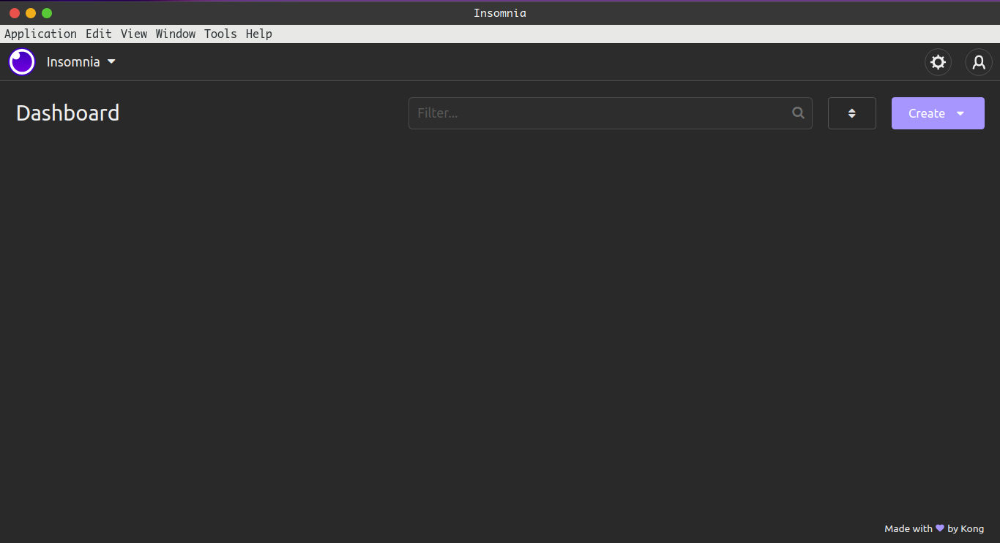
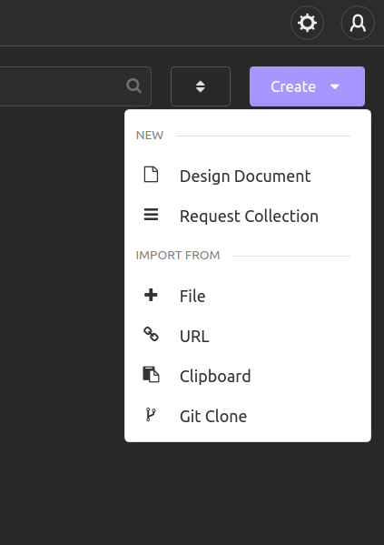
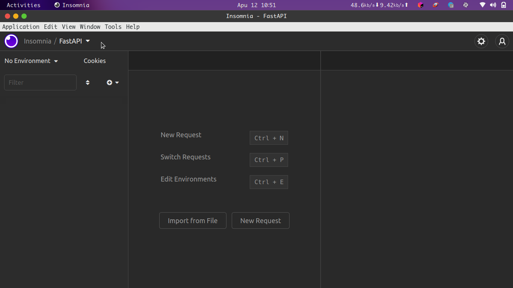

# 02 Requests
In the previous example, we created our first FastAPI application. We also went ahead and ran it with `uvicorn`. In this post, we are going to look at how requests are made and how a response is returned.  

Each time we create a route like below, we create a function that handles a request to a given URL, this function is invoked when we visit a URL.

```python
@app.get("/")
def index():
    return {"message": "Helo World"}

```  
In this example, we are making a request to the `/` URL and are getting a JSON response of `{"message": "Helo World"}`.  

The route decorator specified includes an HTTP method that is used when making a request. In our example, this is the `GET` request. Now let us create more routes by adding this code.

```python
@app.get('/{name}')
def greet_name(name:str):
    
    return {"name":f"Hello {name}"}


@app.get("/greet")
def greet_otional_name(name:Optional[str]="World"):

    return {"message": f"Helo {name}"}
```  
We have created two URLs one is `/{name}` and this takes in a path parameter. The second one is `/greet` and this should take in an optional query parameter `name` that defaults to `"World"`.  


### Let us change something.
For the previous examples, we have been using our web Browser to make requests to our URLs. We are going to change to [Insomnia](https://insomnia.rest/). This is an open-source API client that allow us to easily and quickly send [REST](https://en.wikipedia.org/wiki/Representational_state_transfer), [GraphQL](https://en.wikipedia.org/wiki/GraphQL), [SOAP](https://en.wikipedia.org/wiki/SOAP) and [GRPC](https://en.wikipedia.org/wiki/GRPC) requests.  

I know that has been a lot. But basically `Insomnia` will really help us to make requests to our REST API easily.  

### Steps to Use Insomnia
- Download one for your operating system [here](https://insomnia.rest/download)
- Install it.
- Open it and you will see the following home screen.  

  

- Create a request collection  

  

- Give the collection a name  


- Then you will go to this UI  


- Create a request and make a request  


